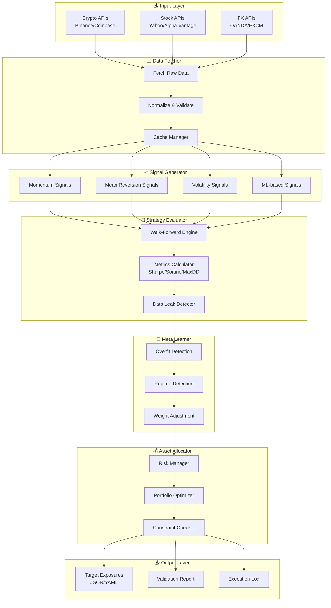

# Multi-Asset Portfolio System - Architecture Design

> **Version**: 1.0.0
> **Created**: 2026-01-28
> **Author**: Ashigaru1 (Senior Software Engineer)

## 1. Overview

複数アセットクラス（仮想通貨、株式、FX等）に対応し、複数のシグナル（戦略）を同一ルールで検証・評価するシステム。過学習・データリーク防止を考慮した動的重み付けにより、最適なアセット配分を出力する。

### 1.1 Design Goals

- **Modularity**: 各コンポーネントの独立性を保ち、テスト・拡張を容易にする
- **Reproducibility**: 全ての処理結果を再現可能にする（シード管理、バージョン管理）
- **Robustness**: 過学習・データリークを防止する評価フレームワーク
- **Production-Ready**: 監視、停止条件、ログ機能を標準装備

---

## 2. Module Structure

```
┌─────────────────────────────────────────────────────────────────────┐
│                         ORCHESTRATOR                                │
│                   (Pipeline Coordination)                           │
└─────────────────────────────────────────────────────────────────────┘
         │              │              │              │
         ▼              ▼              ▼              ▼
┌─────────────┐ ┌─────────────┐ ┌─────────────┐ ┌─────────────┐
│    DATA     │ │   SIGNAL    │ │  STRATEGY   │ │    META     │
│   FETCHER   │ │  GENERATOR  │ │  EVALUATOR  │ │  LEARNER    │
└─────────────┘ └─────────────┘ └─────────────┘ └─────────────┘
         │              │              │              │
         └──────────────┴──────────────┴──────────────┘
                                │
                                ▼
                    ┌─────────────────────┐
                    │  ASSET ALLOCATOR    │
                    │  (Weight Output)    │
                    └─────────────────────┘
```

### 2.1 Module Descriptions

| Module | Responsibility | Input | Output |
|--------|----------------|-------|--------|
| **Data Fetcher** | 各アセットクラスの価格・出来高データ取得 | API設定, Symbol List | Normalized DataFrame |
| **Signal Generator** | 各シグナル（戦略）のスコア生成 | Price Data | Signal Scores per Asset |
| **Strategy Evaluator** | Walk-Forward検証、メトリクス計算 | Signal Scores, Config | Performance Metrics |
| **Meta Learner** | 過学習検出、動的重み調整 | Performance Metrics | Strategy Weights |
| **Asset Allocator** | 最終的なアセット配分決定 | Strategy Weights, Risk Config | Target Exposures |
| **Orchestrator** | パイプライン全体の制御 | Config | Final Output |

---

## 3. Data Flow Diagram



---

## 4. Directory Structure

```
multi-asset-portfolio/
├── src/
│   ├── __init__.py
│   ├── main.py                      # Entry point
│   ├── config/
│   │   ├── __init__.py
│   │   ├── settings.py              # Global settings
│   │   └── schemas.py               # Pydantic schemas
│   │
│   ├── data/
│   │   ├── __init__.py
│   │   ├── fetcher.py               # Data Fetcher base class
│   │   ├── adapters/
│   │   │   ├── __init__.py
│   │   │   ├── crypto.py            # Binance, Coinbase adapters
│   │   │   ├── stock.py             # Yahoo, Alpha Vantage adapters
│   │   │   └── fx.py                # OANDA, FXCM adapters
│   │   ├── normalizer.py            # Data normalization
│   │   └── cache.py                 # Cache management
│   │
│   ├── signals/
│   │   ├── __init__.py
│   │   ├── base.py                  # Signal base class
│   │   ├── momentum.py              # Momentum signals
│   │   ├── mean_reversion.py        # Mean reversion signals
│   │   ├── volatility.py            # Volatility signals
│   │   └── ml_signals.py            # ML-based signals
│   │
│   ├── strategy/
│   │   ├── __init__.py
│   │   ├── evaluator.py             # Strategy Evaluator
│   │   ├── walk_forward.py          # Walk-Forward Engine
│   │   ├── metrics.py               # Performance metrics
│   │   └── leak_detector.py         # Data leak detection
│   │
│   ├── meta/
│   │   ├── __init__.py
│   │   ├── learner.py               # Meta Learner
│   │   ├── overfit_detector.py      # Overfit detection
│   │   └── regime_detector.py       # Market regime detection
│   │
│   ├── allocation/
│   │   ├── __init__.py
│   │   ├── allocator.py             # Asset Allocator
│   │   ├── risk_manager.py          # Risk management
│   │   ├── optimizer.py             # Portfolio optimization
│   │   └── constraints.py           # Constraint handling
│   │
│   ├── orchestrator/
│   │   ├── __init__.py
│   │   ├── pipeline.py              # Pipeline orchestration
│   │   └── scheduler.py             # Execution scheduler
│   │
│   └── utils/
│       ├── __init__.py
│       ├── logger.py                # Logging utilities
│       ├── monitoring.py            # System monitoring
│       └── reproducibility.py       # Seed management
│
├── tests/
│   ├── __init__.py
│   ├── unit/
│   │   ├── test_data_fetcher.py
│   │   ├── test_signals.py
│   │   ├── test_evaluator.py
│   │   └── test_allocator.py
│   └── integration/
│       └── test_pipeline.py
│
├── config/
│   ├── default.yaml                 # Default configuration
│   ├── production.yaml              # Production settings
│   └── assets/
│       ├── crypto.yaml              # Crypto asset definitions
│       ├── stock.yaml               # Stock asset definitions
│       └── fx.yaml                  # FX asset definitions
│
├── data/
│   ├── cache/                       # Cached data
│   └── output/                      # Output files
│
├── logs/                            # Log files
│
├── docs/
│   ├── api/                         # API documentation
│   └── design/                      # Design documents
│
├── pyproject.toml                   # Project metadata & dependencies
├── Makefile                         # Common tasks
└── README.md
```

---

## 5. Technology Stack

### 5.1 Core

| Category | Technology | Rationale |
|----------|------------|-----------|
| **Language** | Python 3.11+ | Type hints, performance improvements |
| **Package Manager** | uv / poetry | Modern dependency management |
| **Configuration** | Pydantic + YAML | Type-safe config with validation |

### 5.2 Data Processing

| Category | Technology | Rationale |
|----------|------------|-----------|
| **DataFrame** | Polars | Faster than Pandas, memory efficient |
| **Numeric** | NumPy | Standard numerical computing |
| **Time Series** | pandas (for compatibility) | Legacy API support |

### 5.3 Financial Analysis

| Category | Technology | Rationale |
|----------|------------|-----------|
| **Backtesting** | vectorbt | Vectorized backtesting, fast |
| **Optimization** | cvxpy | Convex optimization for portfolio |
| **Risk Metrics** | empyrical | Standard risk metrics |

### 5.4 Machine Learning

| Category | Technology | Rationale |
|----------|------------|-----------|
| **ML Framework** | scikit-learn | Standard ML algorithms |
| **Deep Learning** | PyTorch (optional) | For advanced signal models |
| **Feature Store** | Custom (Polars-based) | Prevent data leakage |

### 5.5 Infrastructure

| Category | Technology | Rationale |
|----------|------------|-----------|
| **Logging** | structlog | Structured logging |
| **Monitoring** | Prometheus + Grafana | Metrics & visualization |
| **Task Queue** | Celery (optional) | Distributed processing |
| **Storage** | SQLite / DuckDB | Local analytical storage |

### 5.6 Development

| Category | Technology | Rationale |
|----------|------------|-----------|
| **Testing** | pytest | Standard testing framework |
| **Linting** | Ruff | Fast, comprehensive linter |
| **Type Check** | mypy | Static type checking |
| **Formatting** | Black | Consistent code style |

---

## 6. Key Design Decisions

### 6.1 Data Leak Prevention

```python
# Walk-Forward validation with embargo period
class WalkForwardEngine:
    def __init__(self, embargo_days: int = 5):
        self.embargo_days = embargo_days  # Gap between train/test

    def split(self, data: DataFrame) -> Iterator[Tuple[DataFrame, DataFrame]]:
        # Ensures no lookahead bias
        ...
```

### 6.2 Reproducibility

```python
# All random operations use managed seeds
from src.utils.reproducibility import SeedManager

with SeedManager(seed=42, components=["numpy", "torch"]):
    # All operations here are reproducible
    signals = generate_signals(data)
```

### 6.3 Plugin Architecture for Signals

```python
# New signals can be added without modifying core code
class SignalRegistry:
    _signals: Dict[str, Type[BaseSignal]] = {}

    @classmethod
    def register(cls, name: str):
        def decorator(signal_cls: Type[BaseSignal]):
            cls._signals[name] = signal_cls
            return signal_cls
        return decorator

@SignalRegistry.register("custom_momentum")
class CustomMomentumSignal(BaseSignal):
    ...
```

---

## 7. Output Format

### 7.1 Target Exposures (JSON)

```json
{
  "timestamp": "2026-01-28T14:00:00Z",
  "rebalance_date": "2026-01-29",
  "exposures": {
    "BTC-USD": 0.15,
    "ETH-USD": 0.10,
    "AAPL": 0.20,
    "GOOGL": 0.15,
    "EUR-USD": 0.10,
    "JPY-USD": 0.05,
    "CASH": 0.25
  },
  "metadata": {
    "total_weight": 1.0,
    "confidence": 0.78,
    "regime": "risk_on"
  }
}
```

### 7.2 Validation Report (YAML)

```yaml
validation_report:
  generated_at: "2026-01-28T14:00:00Z"
  walk_forward_results:
    sharpe_ratio: 1.45
    sortino_ratio: 2.10
    max_drawdown: -0.12
    win_rate: 0.58
  overfit_metrics:
    train_test_gap: 0.15
    cv_stability: 0.92
    regime_consistency: 0.85
  warnings:
    - "Strategy X shows potential overfitting (gap > 0.2)"
```

---

## 8. Production Considerations

### 8.1 Monitoring & Alerting

- **Metrics**: Signal quality, execution latency, data freshness
- **Alerts**: Circuit breakers for abnormal market conditions
- **Dashboards**: Real-time portfolio state visualization

### 8.2 Stop Conditions

```yaml
stop_conditions:
  max_drawdown: -0.20        # Stop if drawdown exceeds 20%
  daily_loss_limit: -0.05    # Stop if daily loss exceeds 5%
  signal_divergence: 3.0     # Stop if signals diverge significantly
  data_staleness_hours: 1    # Stop if data is stale
```

### 8.3 Logging Strategy

```
[INFO]  2026-01-28T14:00:00 | Pipeline started | run_id=abc123
[INFO]  2026-01-28T14:00:05 | Data fetched | assets=15 | rows=50000
[INFO]  2026-01-28T14:00:30 | Signals generated | strategies=8
[WARN]  2026-01-28T14:00:45 | Overfit detected | strategy=momentum_fast
[INFO]  2026-01-28T14:01:00 | Allocation complete | total_weight=1.0
```

---

## 9. Notes

### 9.1 Missing Specification References

本設計はタスク記載の情報に基づいて作成。以下の仕様セクションは参照不可であった：

- §2 スコープ
- §3 入力データ要件
- §4 シグナル/戦略カタログ
- §11 I/Oフォーマット

これらの仕様が提供された場合、設計の詳細化・調整が必要となる可能性がある。

### 9.2 Future Enhancements

- Multi-factor model integration
- Real-time streaming data support
- Distributed backtesting (Dask/Ray)
- AutoML for signal selection
